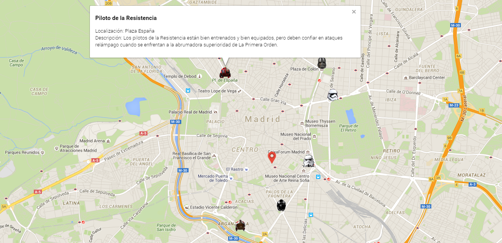

# Face the Force con HTML5

Como puedes ver... Madrid ha sido invadida por cascos gigantes de Star Wars! Estarán en al ciudad las próximas semanas (30/10/2015-30/11/2015).

La idea de este repositorio es hacer usar el poder de HTML5 API para crear ejemplos y aplicaciones interactivas usando como excusa [los ocho cascos gigantes repartidos por toda la ciudad](http://hipertextual.com/2015/10/cascos-de-star-wars-en-madrid).

### Los cascos 

- **Captain Phasma**

- Detalles:
	- Ubicación: Plaza Colón 
	- Longitud: 40.425232 
	- latitud: -3.690493
	- Descripción: La Capitán Phasma porta una distintiva armadura metálica y comanda las legiones de La Primera Orden.

- **Stormtrooper**

- Detalles:
	- Ubicación: Museo Reina Sofía 
	- Longitud: 40.408583
	- Latitud: -3.693466
	- Descripción: Los soldados de asalto son tropas de choque de élite extremamente leales al Imperio, por lo que resulta imposible desviarlos de la causa imperial. Visten imponentes armaduras blancas que cuentan con una amplia variedad de equipos de supervivencia y controles de temperatura que permiten a los soldados sobrevivir en casi cualquier entorno. Los soldados de asalto empuñan pistolas y rifles bláster con gran destreza, y atacaban en hordas para oprimir a sus enemigos. Junto a los soldados de asalto estándar, el Imperio organizó varias unidades especiales, incluidos los soldados exploradores y los soldados de las nieves.

- **First Order Stormtrooper**

- Detalles:
	- Ubicación: Puerta de Alcalá 
	- Longitud: 40.419865
	- Latitud: -3.688087
	- Descripción: Equipados con una impecable armadura y poderosas armas, los Stormtroopers imponen la voluntad de La Primera Orden.

- **Resistance pilot**

- Detalles:
	- Ubicación: Plaza España 
	- Longitud: 40.423486
	- Latitud: -3.712074
	- Descripción: Los pilotos de la Resistencia están bien entrenados y bien equipados, pero deben confiar en ataques relámpago cuando se enfrentan a la abrumadora superioridad de La Primera Orden.

- **Imperial pilot**

- Detalles:
	- Ubicación: Santa María de la Cabeza 
	- Longitud: 40.400988
	- Latitud: -3.699544
	- Descripción: Los pilotos imperiales confían en sus rápidos reflejos y su valentía para sobrevivir a las misiones contra los enemigos del Imperio. Los cazas imperiales disponían de un blindaje ligero y carecían de escudos. Solo los mejores pilotos se ganaron sus alas como expertos.

- **Rebel pilot**

- Detalles:
	- Ubicación: Madrid Rio 
	- Longitud: 40.397563
	- Latitud: -3.708626
	- Descripción: Los pilotos son uno de los mejores activos de la Alianza Rebelde. Hay casi tantas historias como pilotos: los cazas rebeldes son pilotados por desertores del imperio, mercenarios reformados, granjeros en busca de aventuras y temerarios que sólo se sentían realmente vivos en una cabina de mando. Independientemente de sus orígenes, los pilotos rebeldes aprendieron a trabajar juntos, confiando en sus compañeros así como en su entrenamiento en incontables batallas contra el Imperio.

- **Darth Vader**

- Detalles:
	- Ubicación: Glorieta de Bilbao 
	- Longitud: 40.429246
	- Latitud: -3.702635
	- Descripción: Darth Vader, quien fuera una vez un heroico Caballero Jedi, fue seducido por el lado oscuro de la Fuerza, se convirtió en un Lord Sith y condujo al imperio para destruir la Orden Jedi. Durante décadas, permaneció al servicio del Emperador, el malvado Darth Sidious, e hizo cumplir la voluntad de su Maestro tratando de aplastar a la incipiente Alianza Rebelde. Pero todavía había bondad en él...

- **First Order Flametrooper**

- Detalles:
	- Ubicación: Estadio Santiago Bernabéu 
	- Longitud: 40.452467
	- Latitud: -3.689861
	- Descripción: Los Flametroopers son soldados imperiales especializados de la Primer Orden. Portan armas incendiarias que pueden transformar cualquier campo de batalla en una llamarada infernal.

### Demos:

**Geoposicionamiento**

- Usuario y los cascos en un mapa (Google Maps)

[código](demos/helmets_map.html)

### Agradecimientos y creditos:

- Imágenes y textos (documentación):
	- [El Mundo](http://elmundo.es)
	- [Somos Malasaña](http://www.somosmalasana.com)
	- [New Cinema](http://newcinema.es)
	- [Arena Jugones](http://cdn3.areajugones.es)
	- [Face the force](http://facetheforce.com/)

- Imágenes y textos (demos):
	
	- [Iconfinder](https://www.iconfinder.com/)
	- [Face the force](http://facetheforce.com/)
